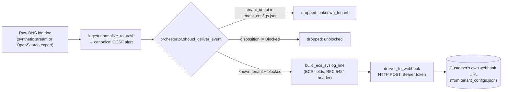
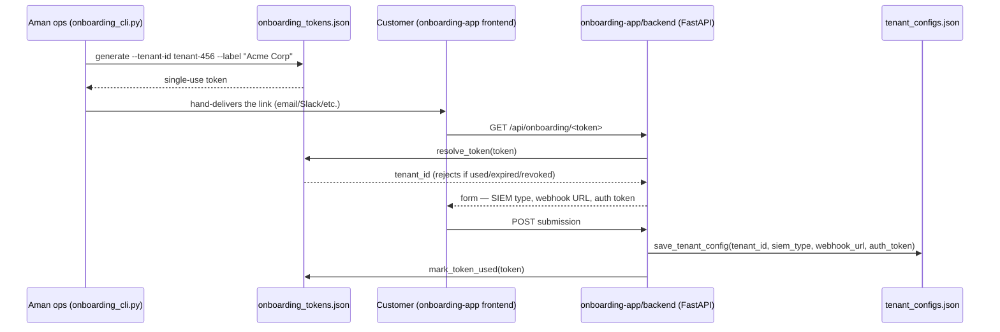

# Aman SIEM Pipeline

Delivers IntelliBroń Aman's blocked-DNS security events to a customer's own
SIEM, over a webhook they provide, in ECS field names framed as a syslog
message. That's the whole current scope — nothing more.

**Start here:** [`HANDOFF.md`](./HANDOFF.md) — what's proven, how it works,
what's a prototype vs. real, what's left. This README goes deeper on *why*
it's built this way and walks through a real event end to end; `HANDOFF.md`
stays the short status summary.

## Two things to understand before anything technical

The rest of this doc, and the code itself, leans hard on two ideas. Neither
is obvious from a file name, so plain-language first:

**`tenant_configs.json` is the address book.** Every alert this pipeline
sends starts with the same question: *which customer does this belong to,
and where does their data go?* This one file answers both — one entry per
customer, holding their webhook address, their access token, and which SIEM
they run. Every single alert gets checked against this file before it goes
anywhere. If the customer isn't in it, nothing is sent — no guessing, and no
risk of one customer's data reaching another customer's address.

That's also why the code that reads/writes this file is unusually careful
about it. Two different tools can try to save to it at the same moment — the
customer signup page, and the internal dashboard. Without a safeguard, the
second save can silently erase the first one's change, and a customer's
webhook disappears with no error anywhere. So every write locks the file
first (only one writer touches it at a time) and writes to a temporary copy
before swapping it in, so a crash mid-save can never leave a broken,
half-written file behind.

**The signup link is a one-time claim ticket, not a plain ID.** When a
customer gets onboarded, they're sent a link containing a random token — not
their actual customer ID. The moment they submit their webhook through that
link, the token is marked used and can't be reused. If someone tries a
token that's fake, expired, already used, or revoked, they all get back the
exact same generic "this link is invalid" message. That's deliberate: the
system never says *why* a token failed, so nobody can use failed attempts to
confirm a real customer or token exists.

Everything below restates these two ideas at the code level — which files,
which functions, in what order.

## Why a webhook, and not a native SIEM integration

In plain terms first: think of a webhook as one plain mailbox. The customer
hands us one address (a URL) and one key (a token), and we mail our alert
there, in a plain, universal format. The alternative — a "native
integration" — means custom-wiring our alert directly into one specific
SIEM product's own internal system, in that product's own special format,
so it shows up as a polished, built-in alert inside that product's
dashboard. That's real, ongoing work: it has to be built, and then kept
working, separately for every SIEM product that exists — it doesn't scale
to "any SIEM a customer happens to run."

Right now, this pipeline deliberately does the mailbox version: deliver the
raw alert to that one address, plainly formatted. Making it show up as a
polished, native alert inside the customer's own SIEM is left to the
customer's own setup — that's an explicit scope decision (see reason 1
below), not something this pipeline is technically incapable of.

Everything from here restates the same reasoning at the code level — same
idea, in terms of actual files and functions.

A **webhook**, in this repo, means exactly one thing: a plain HTTP(S) `POST`
to a URL the customer supplies, with a bearer token they also supplied. That
gets a real status code back, which is how `deliver_to_webhook` knows
delivery actually succeeded. It is *not* the same thing as
`orchestrator.py`'s raw UDP syslog transport (used for Wazuh/Graylog native
delivery) — that opens a socket and gets no delivery confirmation at all.
The two are easy to conflate because both eventually produce a
syslog-formatted line; only the transport differs.

Three reasons this pipeline pushes plain, generic data over a customer
webhook instead of building a native alert integration per SIEM:

1. **It's the scope decision, not a technical shortcut.** Per `HANDOFF.md`
   and `ARCHITECTURE.md` §3.4: pushing the data to a customer's SIEM is
   Aman's job; making it render as a native, correlated *alert* inside that
   SIEM's own UI is the customer's own configuration — unless that decision
   changes. `orchestrator.py` / `translator.py` already do the harder
   version of this — each one wrapped in that specific product's own data
   format (Splunk's HEC events, Sentinel/Datadog's envelopes, Elastic/Wazuh's
   NDJSON bulk format, Wazuh/Graylog's syslog with a platform-specific
   decoder) — for a fixed list of `SUPPORTED_SIEMS`. That's a real,
   larger commitment — a format/decoder per platform, kept in sync as each
   platform's own ingestion format changes — and it's a separate engine on
   purpose, not what's currently shipping.
2. **A generic webhook is the lowest common denominator.** Every SIEM (and
   most other ingestion tooling) can receive an HTTP POST to a URL. Betting
   on "POST this to a URL the customer owns" means this pipeline never needs
   to know anything platform-specific about that customer's SIEM beyond the
   URL and a token — unlike the native path, which has to keep a hand-built
   mapping for every product it supports.
3. **It reuses the already-tested core, it doesn't re-derive it.**
   `should_deliver_event` (tenant isolation, then the blocked-only filter)
   and `normalize_to_ocsf` (raw log → canonical OCSF alert) are the exact
   same functions `orchestrator.py`'s full engine uses and already has tests
   for. `ecs_syslog_webhook.py` only adds the two things that engine doesn't
   have: a plain ECS-over-syslog line format, and a plain HTTP POST.

## How it works



A `webhook_url` with a `syslog://` scheme (Wazuh/Graylog's raw-UDP option)
is deliberately **not** delivered here — `run_simple_pipeline` counts it as
`dropped_unsupported_transport` and logs a warning. This pipeline is
HTTP-webhook-only by definition; a tenant on that transport needs
`orchestrator.py`'s engine instead.

### Where a tenant's webhook + token come from

`ecs_syslog_webhook.py` never collects a customer's webhook itself — it only
reads what's already in `tenant_configs.json`. Today, that file gets
written by the onboarding prototype:



`resolve_token` returns one generic 404 for every failure reason (unknown,
expired, already used, revoked) — distinguishing them to the client would
let someone confirm a guessed token ever existed. See "important" note in
`HANDOFF.md`: in the real product, this same submission happens inside the
actual Aman dashboard, not this standalone onboarding page — whoever builds
that flow just needs to write into `tenant_configs.json` in this same shape,
via `config_store.save_tenant_config` directly or by copying the pattern.

## A real event, end to end

This is actual output from running the pipeline's own functions on one
sample DNS log doc — not hand-written:

```python
from ingest import normalize_to_ocsf
from ecs_syslog_webhook import build_ecs_syslog_line

raw_doc = {
    "@timestamp": "2026-09-01T02:14:07Z",
    "subscriber.id": "tenant-123",
    "destination.domain": "phishing-kit.example",
    "destination.blocked": True,
    "rule.category": "malicious",
    "source.ip": "203.153.118.242",
}

alert = normalize_to_ocsf(raw_doc)
```

`alert` is now the canonical OCSF shape everything downstream reads —
`should_deliver_event`, `build_ecs_syslog_line`, and the full
`orchestrator.py` engine all key off exactly this:

```json
{
  "class_uid": 4003,
  "class_name": "DNS Activity",
  "time": "2026-09-01T02:14:07.000Z",
  "severity": "Critical",
  "category_name": "malicious",
  "disposition": "Blocked",
  "action": "Denied",
  "tenant": { "uid": "tenant-123" },
  "query": { "hostname": "phishing-kit.example", "type": "ANY" },
  "metadata": { "product": { "vendor_name": "PT ITSEC Asia", "name": "IntelliBron Aman" } },
  "src_endpoint": { "ip": "203.153.118.242" }
}
```

`build_ecs_syslog_line(alert)` turns that into the exact line
`deliver_to_webhook` POSTs as the request body (`Content-Type: text/plain`,
`Authorization: Bearer <tenant's token>`):

```
<34>1 2026-09-01T02:14:07.000Z aman-pipeline aman-dns - - - {"@timestamp":"2026-09-01T02:14:07.000Z","event":{"type":["denied"],"category":["network"],"action":"blocked"},"source":{"ip":"203.153.118.242"},"dns":{"question":{"name":"phishing-kit.example","type":"ANY"}},"severity":"Critical"}
```

Two things worth knowing about that line if you're reading it for the first
time:

- **`<34>`** is the RFC 5424 PRI value: `facility(4, security) * 8 +
  level(2, critical)`. `translator._SEVERITY_TO_SYSLOG_LEVEL` is the same
  severity→syslog-level table the full engine's UDP path already uses —
  this module doesn't invent a second mapping.
- **Everything after `- - - `** is JSON, not further syslog structure — the
  `- - -` are the (unused) PROCID/MSGID/STRUCTURED-DATA fields RFC 5424
  requires a placeholder for. `event.severity` is deliberately *not* one of
  the ECS fields set here: ECS's own docs describe it as an open numeric
  field with no fixed scale, so this pipeline carries severity only as the
  plain top-level `"severity"` string instead of inventing an ECS
  convention that doesn't exist.

One gotcha for anyone extending this file: `build_ecs_syslog_line` calls
`translator._ecs_fields` and `translator._SEVERITY_TO_SYSLOG_LEVEL`
directly — both are leading-underscore, "private" to `translator.py`. That's
deliberate (see the module docstring): reusing them exactly, rather than
copying the field-mapping logic, is what guarantees this simple path and the
full `orchestrator.py` engine can never silently drift apart on what a given
severity or ECS field actually means.

## Quick orientation

- `ecs_syslog_webhook.py` — the pipeline described above. Normalizes an
  event, checks it was actually blocked, sends it to whichever customer it
  belongs to's webhook.
- `ingest.py` — `normalize_to_ocsf`: turns a raw log doc (synthetic
  generator or real OpenSearch export) into the canonical OCSF alert shape
  everything else reads.
- `orchestrator.py` — `should_deliver_event` (tenant isolation + blocked-only
  filter, reused above) plus the full delivery engine: batching, retries,
  dead-letter queue, per-SIEM native alerting. Not what's shipping right
  now — see `HANDOFF.md`.
- `translator.py` — per-SIEM field mapping and formatting (Splunk CIM,
  Sentinel ASIM, Elastic ECS, Datadog, GELF, syslog bodies). Its private ECS
  helpers are reused directly by `ecs_syslog_webhook.py`, as noted above.
- `config_store.py` / `tenant_configs.json` — where a tenant's `webhook_url`,
  `auth_token`, `siem_type`, and `verify_ssl` live. Validated by
  `config_store.normalize_config`; written under an exclusive file lock so
  concurrent writers (the onboarding API and the dashboard) can't silently
  lose each other's update.
- `onboarding-app/` — a **prototype** letting a customer submit their own
  webhook URL/token through a one-time link (diagram above). This proves the
  pipeline can be driven by customer-submitted config. **It is not the real
  product surface** — see `HANDOFF.md` for what that means for production.

## Running it

```bash
python3 -m unittest discover -s tests   # run everything

# Issue a customer a one-time onboarding link (writes onboarding_tokens.json)
python3 onboarding-app/backend/onboarding_cli.py generate --tenant-id tenant-456 --label "Acme Corp"

# Run the webhook pipeline against whatever's in tenant_configs.json
python3 ecs_syslog_webhook.py --source synthetic --limit 20
```

## Further reading

- [`HANDOFF.md`](./HANDOFF.md) — current status, what's proven vs.
  prototype, what's left.
- [`ARCHITECTURE.md`](./ARCHITECTURE.md) — the full engine
  (`orchestrator.py`/`translator.py`) in depth, including the native
  per-SIEM alerting this pipeline deliberately doesn't do (§3.4), and known
  open issues (e.g. the tenant-mapping gap against real ClickHouse data,
  §6).
- [`PROGRESS.md`](./PROGRESS.md) — phase-by-phase task history.
