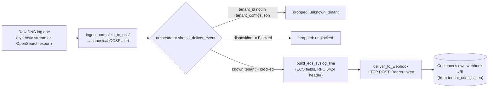
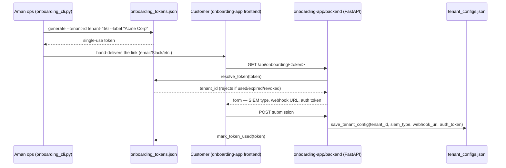

# Aman SIEM Pipeline

Delivers IntelliBroń Aman's blocked-DNS security events to a customer's own
SIEM, over a webhook they provide, in ECS field names framed as a syslog
message. That's the whole current scope — nothing more.

**Start here:** [`HANDOFF.md`](./HANDOFF.md) — what's proven, how it works,
what's a prototype vs. real, what's left. This README goes deeper on *why*
it's built this way and walks through a real event end to end; `HANDOFF.md`
stays the short status summary.

## Two things worth knowing

`tenant_configs.json` is the address book. Every alert this pipeline sends
starts with the same question: which customer does this belong to, and
where does their data go? One file answers both. One entry per customer,
holding their webhook address, their access token, and which SIEM they run.
Every alert gets checked against it before anything is sent. Unknown
customer, nothing gets sent — no guessing, and no risk of one customer's
data landing at another customer's address.

The code around this file is careful for a reason. Two different tools can
try to save to it at the same moment: the customer signup page and the
internal dashboard. Without a lock, the second save silently overwrites the
first one's change, and a customer's webhook disappears with no error
anywhere. So a write takes an exclusive lock on the file, and saves to a
temporary copy before swapping it in — a crash mid-save can't leave a
broken file behind.

The signup link itself is a one-time claim ticket, not a plain ID. The link
a customer receives contains a random token, not their actual customer ID.
The moment they submit their webhook through it, that token is marked used
and can't be reused. Try a fake token, an expired one, an already-used one,
a revoked one — all four get back the exact same "this link is invalid"
message. That's on purpose: the system never explains *why* a token failed,
so a failed attempt can't be used to confirm a real customer or token
exists.

## Why a webhook instead of a native SIEM integration

A webhook here is one plain mailbox. The customer hands over an address (a
URL) and a key (a token), and this pipeline mails the alert there in a
plain, shared format. Building a "native integration" instead means wiring
the alert into one specific SIEM product's own internals, in that product's
own format, so it shows up as a polished, built-in alert on that product's
dashboard. Real work, and it has to be built and kept working separately
for every SIEM product out there — it doesn't scale to "whatever SIEM a
customer happens to run."

This pipeline does the mailbox version, on purpose. Delivering the raw
alert to that one address is the job here; making it look like a native
alert inside the customer's own SIEM is left to their own setup. That's a
scope decision, not a limitation — more on that below.

More precisely: a webhook means a plain HTTP(S) `POST` to a URL the
customer supplies, with a bearer token they also supplied, and it gets a
real status code back. `deliver_to_webhook` checks that status code to know
delivery actually succeeded. That's different from `orchestrator.py`'s raw
UDP syslog transport, used for native Wazuh/Graylog delivery, which opens a
socket and gets no confirmation at all. Easy to mix the two up since both
end up as a syslog-formatted line — only the transport differs.

A few things point at this design instead of a native integration per SIEM:

- It matches the existing scope decision (`HANDOFF.md`, `ARCHITECTURE.md`
  §3.4): pushing data to a customer's SIEM is Aman's job, and rendering it
  as a native, correlated alert inside that SIEM's own UI is the customer's
  configuration, unless that changes. `orchestrator.py`/`translator.py`
  already do the harder version — wrapping each alert in a specific
  product's own format (Splunk's HEC events, Sentinel/Datadog's envelopes,
  Elastic/Wazuh's NDJSON bulk, Wazuh/Graylog's syslog with a platform
  decoder) — for a fixed list of `SUPPORTED_SIEMS`. Real, ongoing work,
  kept in sync as each platform's ingestion format changes. A separate
  engine, and not what's shipping.
- Every SIEM, and most other ingestion tooling, can receive a plain HTTP
  POST — that's the lowest common denominator. This pipeline never needs to
  know anything platform-specific beyond a URL and a token, where the
  native path has to keep a hand-built mapping per product.
- `should_deliver_event` and `normalize_to_ocsf` are the same functions
  `orchestrator.py`'s full engine already uses and already has tests for.
  `ecs_syslog_webhook.py` only adds what that engine doesn't have: a plain
  ECS-over-syslog line, and a plain POST.

## How it works



A `webhook_url` with a `syslog://` scheme (Wazuh/Graylog's raw-UDP option)
is deliberately **not** delivered here — `run_simple_pipeline` counts it as
`dropped_unsupported_transport` and logs a warning. This pipeline is
HTTP-webhook-only by definition; a tenant on that transport needs
`orchestrator.py`'s engine instead.

### Where a tenant's webhook + token come from

`ecs_syslog_webhook.py` never collects a customer's webhook itself — it only
reads what's already in `tenant_configs.json`. Today, that file gets
written by the onboarding prototype:



`resolve_token` returns one generic 404 for every failure reason (unknown,
expired, already used, revoked) — distinguishing them to the client would
let someone confirm a guessed token ever existed. See "important" note in
`HANDOFF.md`: in the real product, this same submission happens inside the
actual Aman dashboard, not this standalone onboarding page — whoever builds
that flow just needs to write into `tenant_configs.json` in this same shape,
via `config_store.save_tenant_config` directly or by copying the pattern.

## A real event, end to end

This is actual output from running the pipeline's own functions on one
sample DNS log doc — not hand-written:

```python
from ingest import normalize_to_ocsf
from ecs_syslog_webhook import build_ecs_syslog_line

raw_doc = {
    "@timestamp": "2026-09-01T02:14:07Z",
    "subscriber.id": "tenant-123",
    "destination.domain": "phishing-kit.example",
    "destination.blocked": True,
    "rule.category": "malicious",
    "source.ip": "203.153.118.242",
}

alert = normalize_to_ocsf(raw_doc)
```

`alert` is now the canonical OCSF shape everything downstream reads —
`should_deliver_event`, `build_ecs_syslog_line`, and the full
`orchestrator.py` engine all key off exactly this:

```json
{
  "class_uid": 4003,
  "class_name": "DNS Activity",
  "time": "2026-09-01T02:14:07.000Z",
  "severity": "Critical",
  "category_name": "malicious",
  "disposition": "Blocked",
  "action": "Denied",
  "tenant": { "uid": "tenant-123" },
  "query": { "hostname": "phishing-kit.example", "type": "ANY" },
  "metadata": { "product": { "vendor_name": "PT ITSEC Asia", "name": "IntelliBron Aman" } },
  "src_endpoint": { "ip": "203.153.118.242" }
}
```

`build_ecs_syslog_line(alert)` turns that into the exact line
`deliver_to_webhook` POSTs as the request body (`Content-Type: text/plain`,
`Authorization: Bearer <tenant's token>`):

```
<34>1 2026-09-01T02:14:07.000Z aman-pipeline aman-dns - - - {"@timestamp":"2026-09-01T02:14:07.000Z","event":{"type":["denied"],"category":["network"],"action":"blocked"},"source":{"ip":"203.153.118.242"},"dns":{"question":{"name":"phishing-kit.example","type":"ANY"}},"severity":"Critical"}
```

Two things worth knowing about that line if you're reading it for the first
time. `<34>` is the RFC 5424 PRI value — `facility(4, security) * 8 +
level(2, critical)` — using the same severity→syslog-level table the full
engine's UDP path already uses (`translator._SEVERITY_TO_SYSLOG_LEVEL`), not
a second mapping invented for this module. And everything after `- - - ` is
JSON, not more syslog structure; the `- - -` are just the (unused)
PROCID/MSGID/STRUCTURED-DATA placeholders RFC 5424 requires. `event.severity`
is deliberately left out of that JSON: ECS's own docs describe it as an open
numeric field with no fixed scale, so severity only carries as the plain
top-level `"severity"` string instead of inventing an ECS convention that
doesn't exist.

One gotcha for anyone extending this file: `build_ecs_syslog_line` calls
`translator._ecs_fields` and `translator._SEVERITY_TO_SYSLOG_LEVEL`
directly — both are leading-underscore, "private" to `translator.py`. That's
deliberate (see the module docstring): reusing them exactly, rather than
copying the field-mapping logic, is what guarantees this simple path and the
full `orchestrator.py` engine can never silently drift apart on what a given
severity or ECS field actually means.

## Quick orientation

- `ecs_syslog_webhook.py` — the pipeline described above. Normalizes an
  event, checks it was actually blocked, sends it to whichever customer it
  belongs to's webhook.
- `ingest.py` — `normalize_to_ocsf`: turns a raw log doc (synthetic
  generator or real OpenSearch export) into the canonical OCSF alert shape
  everything else reads.
- `orchestrator.py` — `should_deliver_event` (tenant isolation + blocked-only
  filter, reused above) plus the full delivery engine: batching, retries,
  dead-letter queue, per-SIEM native alerting. Not what's shipping right
  now — see `HANDOFF.md`.
- `translator.py` — per-SIEM field mapping and formatting (Splunk CIM,
  Sentinel ASIM, Elastic ECS, Datadog, GELF, syslog bodies). Its private ECS
  helpers are reused directly by `ecs_syslog_webhook.py`, as noted above.
- `config_store.py` / `tenant_configs.json` — where a tenant's `webhook_url`,
  `auth_token`, `siem_type`, and `verify_ssl` live. Validated by
  `config_store.normalize_config`; written under an exclusive file lock so
  concurrent writers (the onboarding API and the dashboard) can't silently
  lose each other's update.
- `onboarding-app/` — a **prototype** letting a customer submit their own
  webhook URL/token through a one-time link (diagram above). This proves the
  pipeline can be driven by customer-submitted config. **It is not the real
  product surface** — see `HANDOFF.md` for what that means for production.

## Running it

```bash
python3 -m unittest discover -s tests   # run everything

# Issue a customer a one-time onboarding link (writes onboarding_tokens.json)
python3 onboarding-app/backend/onboarding_cli.py generate --tenant-id tenant-456 --label "Acme Corp"

# Run the webhook pipeline against whatever's in tenant_configs.json
python3 ecs_syslog_webhook.py --source synthetic --limit 20
```

## Further reading

- [`HANDOFF.md`](./HANDOFF.md) — current status, what's proven vs.
  prototype, what's left.
- [`ARCHITECTURE.md`](./ARCHITECTURE.md) — the full engine
  (`orchestrator.py`/`translator.py`) in depth, including the native
  per-SIEM alerting this pipeline deliberately doesn't do (§3.4), and known
  open issues (e.g. the tenant-mapping gap against real ClickHouse data,
  §6).
- [`PROGRESS.md`](./PROGRESS.md) — phase-by-phase task history.
